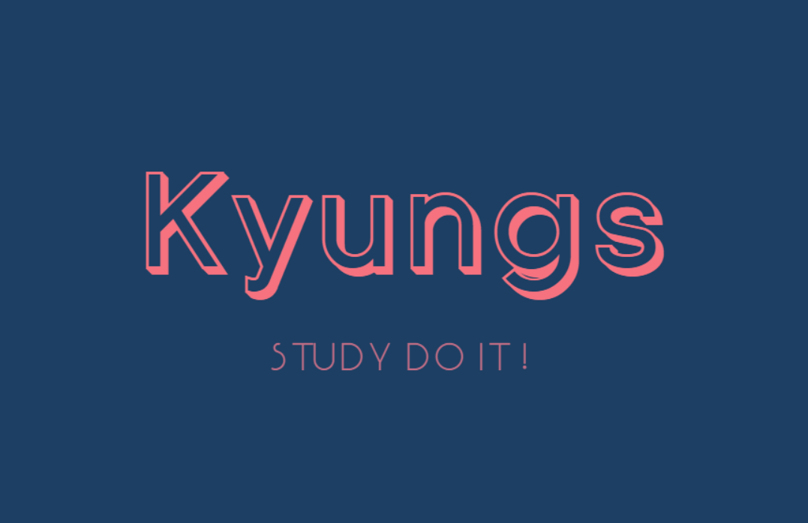

# kyungs
- 함께 프로젝트 하고 스터디한지 어언 1년..~~처음엔 이렇게 오래할지 몰랐지..~~. 비슷한 관심사, 비슷한 기술 스택에 어짜피 계속 만나서 공부하고 리뷰할테니 "이왕하는 김에 GitHub에 꾸준히 기록하자" 싶어서 만든 Organization입니다. 
- Java와 Spring(SpringBoot), WEB, 서버 개발(성능, 안정성, 보안 등)에 관심이 있습니다.
- 지속 가능한 스터디를 꿈꿉니다 🙌.. ~~취업해도 계속 공부하자..!~~

--- 

## 스터디 방식 
- 매주 1회 모여 각자 스터디한 내용을 발표합니다.
- 각 repository를 통해 코드 및 스터디 내용을 공유합니다. 

## 스터디 멤버 
- [고다경](https://github.com/koda93)
- [최윤경](https://github.com/choiyk)

## 코드 공유
1. Kyungs `Organization`에 `repository` 생성
2. 생성한 repository를 본인 GitHub 저장소에 `fork` 
3. fork한 저장소를 `git clone`을 통해 local 작업공간을 생성 
4. 생성한 폴더에서 각자 학습한 내용 및 코드 `commit`
5. 본인 GitHub 계정 원격저장소에 `push`
5. 한 프로세스 단위로 본인의 GitHub repository에서 `Pull Request` 생성 
6. Pull Request 이후 코드 확인 후 `merge`

## 코드 리뷰 
- 스터디 날 repository에 있는 각자 코드를 보며 review

## 스터디 상세 내용 
- [스터디 일지](./log/)

## 비고 
- 혹시 틀리거나 잘못된 내용이 있다면 PR 부탁드립니다 🙏

 